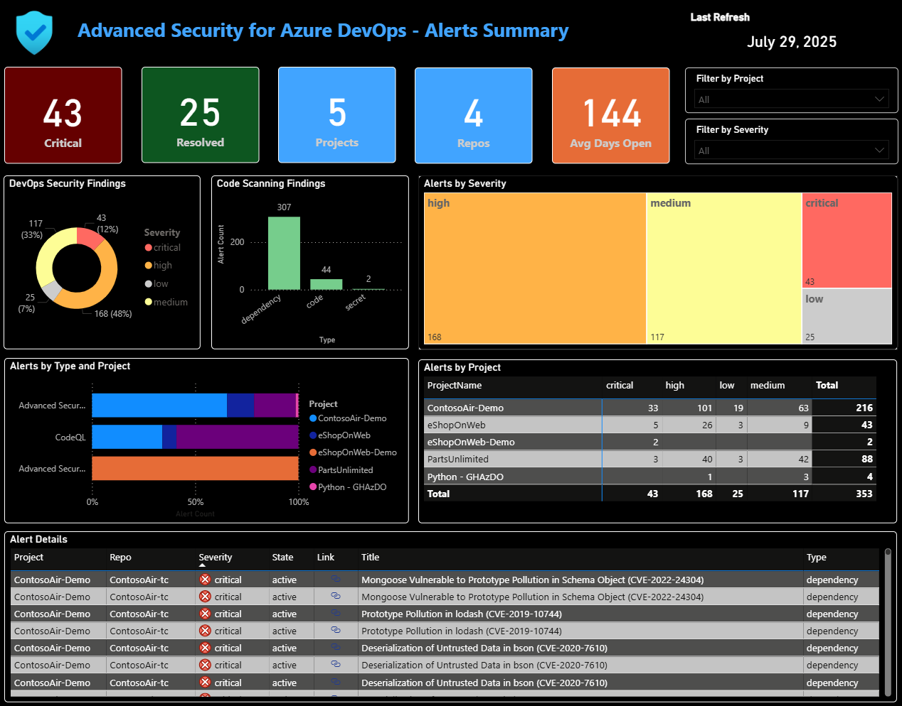
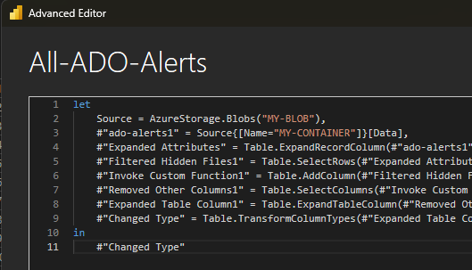

# 🔒 GHAzDO Export - Azure DevOps Advanced Security Alerts Export and Visualization

This repository contains a comprehensive solution for exporting, storing, and visualizing Azure DevOps Advanced Security alerts across your entire organization. The solution includes a PowerShell script that uses Personal Access Token (PAT) authentication to query the Azure DevOps REST API, an Azure DevOps pipeline for automated execution, and a Power BI dashboard for data visualization.

## 📋 Table of Contents

- [✨ Features](#-features)
- [🚀 Usage](#-usage)
- [⚙️ YAML Pipeline Setup](#️-yaml-pipeline-setup)
- [📊 Power BI Dashboard Setup](#-power-bi-dashboard-setup)
- [📋 Requirements](#-requirements)
- [📄 Output](#-output)
- [🔗 References](#-references)

## ✨ Features

- Authenticates using Personal Access Token (PAT)
- Retrieves all projects and repositories in the organization
- Collects all Advanced Security alerts for each repository
- Handles paginated results using continuation tokens
- Exports the collected alert data to a CSV file
- Automated pipeline execution with Azure DevOps YAML pipeline
- Upload results to Azure Storage for centralized data management
- Pre-built Power BI dashboard for visualizing security alert trends and metrics
- Comprehensive reporting across multiple projects and repositories

## 🚀 Usage

1. Create a Personal Access Token (PAT) in Azure DevOps with the required scopes (see Requirements section)
2. Update the `$organization` variable in the script to your Azure DevOps organization name
3. Update the `$pat` variable in the script with your Personal Access Token
4. Run the script in PowerShell:
   ```powershell
   .\Export-Alerts.ps1
   ```
5. The output will be saved as `All-ADO-Alerts.csv` in the current directory.

## ⚙️ YAML Pipeline Setup

To run this script in an Azure DevOps pipeline, create a variable group named `Security-Alerts-Variables` with the following variables:

| Variable Name | Description | Example Value |
|---------------|-------------|---------------|
| `adoPat` | Personal Access Token with required scopes | `your-pat-token-here` |
| `azureServiceConnection` | Azure service connection name | `your-service-connection` |
| `containerName` | Azure Storage container for output files | `security-alerts` |
| `organization` | Azure DevOps organization name | `your-org-name` |
| `outputCsvFile` | Name of the output CSV file | `All-ADO-Alerts.csv` |
| `storageAccountName` | Azure Storage account name | `yourstorageaccount` |

### Setting up the Variable Group:

1. Navigate to your Azure DevOps project
2. Go to **Pipelines** > **Library**
3. Click **+ Variable group**
4. Name it `Security-Alerts-Variables`
5. Add all variables listed above with appropriate values
6. Mark `adoPat` as secret by clicking the lock icon
7. Save the variable group

### Pipeline Configuration:

Reference the variable group in your YAML pipeline:
```yaml
variables:
- group: Security-Alerts-Variables
```

The pipeline will:
1. Execute the PowerShell script to export security alerts
2. Upload the generated CSV file to the specified Azure Storage account container
3. Use the Azure service connection for authentication to the storage account

## 📊 Power BI Dashboard Setup

A sample Power BI dashboard is provided in the `dashboards` folder as `ADO - GHAzDO Report.pbix`. This dashboard visualizes the exported security alerts.



### Connecting to the Blob Data Source

1. Open `ADO - GHAzDO Report.pbix` in Power BI Desktop
2. Go to the **Home** tab and click **Transform data**
3. In the Power Query Editor, select the `All-ADO-Alerts` query
4. Click **Advanced Editor**
5. Update the **blob storage account** and **container name** in the source path to match your Azure Storage configuration



6. Click **Done** and then **Close & Apply** to load the data
7. Refresh the data to pull the latest alerts from your Azure Storage container

You can now use the dashboard to analyze and visualize your Azure DevOps Advanced Security alerts!

## 📋 Requirements

- Personal Access Token (PAT) with the following scopes:
  - **Advanced Security**: Read
  - **Code**: Read
  - **Project and Team**: Read
- Sufficient permissions to access Azure DevOps REST APIs and Advanced Security alerts

## 📄 Output

- `All-ADO-Alerts.csv`: Contains details of all security alerts, including project, repository, alert ID, title, severity, state, tool, and detection dates.

## 🔗 References

- [Azure DevOps Advanced Security Alerts API](https://learn.microsoft.com/en-us/rest/api/azure/devops/advancedsecurity/alerts/get?view=azure-devops-rest-7.2)
- [Azure DevOps Personal Access Tokens](https://learn.microsoft.com/en-us/azure/devops/organizations/accounts/use-personal-access-tokens-to-authenticate)

## Maintainers

@jasonmoodie, @CalinL

## Support

These are just files for you to download and use as you see fit. If you have questions about how to use them, please reach out to the maintainers, but we cannot guarantee a response with SLAs.
